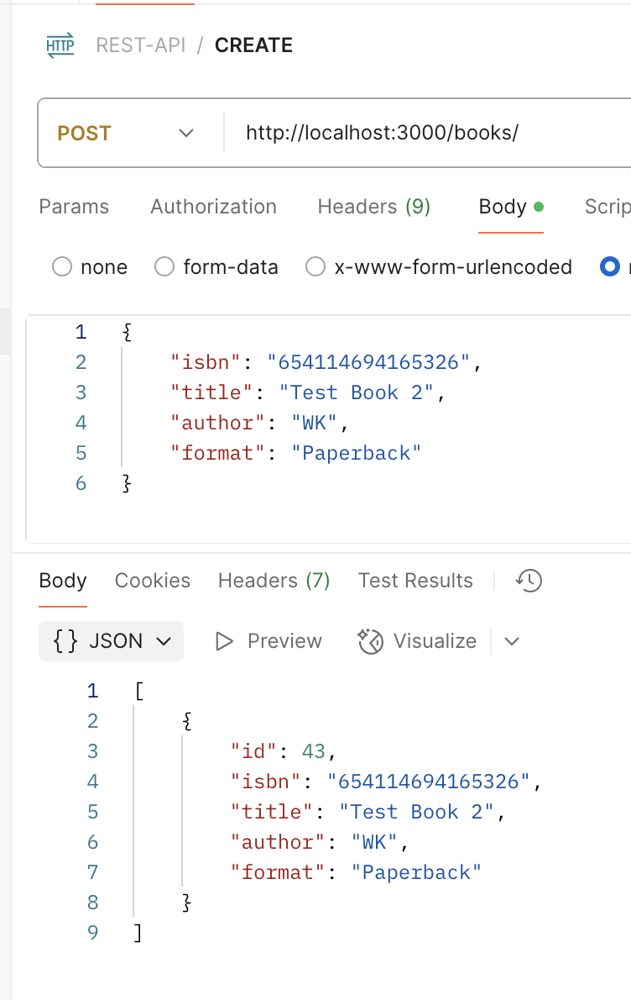
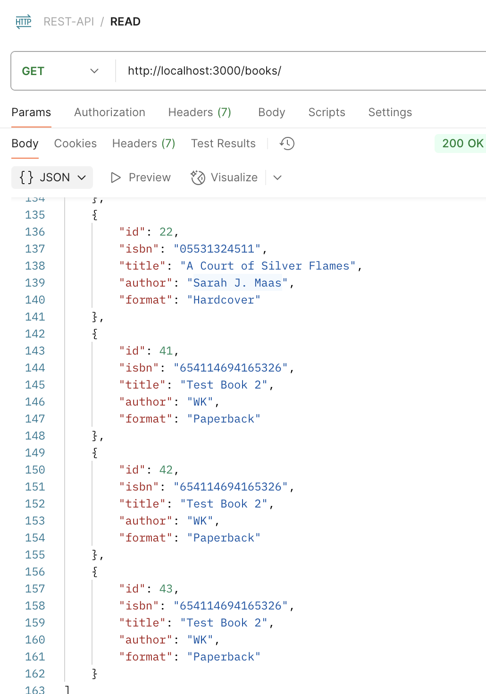
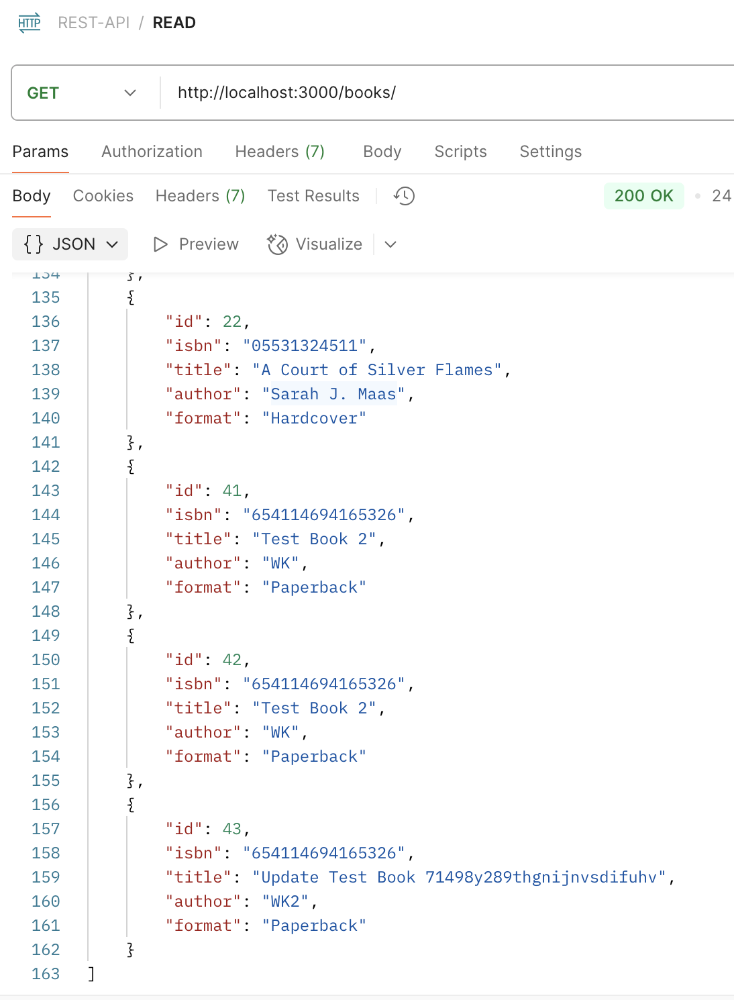

# WELCOME TO MY BOOKS REST API PROJECT
## Table of contents
  1. [Objectives](#objective)
  2. [Prerequisites](#prerequisites)
  3. [Step by step to clone ](#clone)
  4. [Step by step to create your local database ](#database)
  5. [What you'll see](#results)

## OBJECTIVE: <a name="objective"></a>
#### ⭐ Creating a localdatabase
#### ⭐ Linking the localdatabase to perform CRUD operations
#### ⭐ Testing on Postman   
___
## Prerequisites <a name="prerequisites"></a>
##### ⭐ Postgres - (Creating a local database)  
##### ⭐ express  
##### ⭐ node  
##### ⭐postman  
---
###### (You will need to have everything installed for this to work)
###### README is for mac users. 
---
## Step By Step to clone <a name="clone"></a>
1. Goto your Terminal
2. Goto the location you want to clone my repository to
3. Clone my project
   ```git
    git clone https://github.com/wk642/REST-API.git
    ```
4. If you are going to make changes to my code please do the following:
   ```
   cd REST-API
    ls -la
    // if you see a .git (if not, skip next line only)
    rm -rf .git
    git remote -v
    // if this not blank or pointing to yours
    git remote remove origin
    // you can add yours back
    
 5. Reminder: install express

***
## Step by step to create your local database <a name="database"></a>
1. Goto your Terminal
2. Go into postgresss  
   `psql`
3. Create a database  
   `CREATE DATABASE your_database_name`
   * keep this window open. you will come back to this in a few steps
4. Open up the folder you cloned into VSCode / your text editor. 
5. Open up db.js
6. On line 3-9 you will see this, please update the info accordingly: 
   - [ ] On line 4 change user to your username  
    `user: 'YOUR_USERNAME', `
   - [ ] On line 5 change user to your password  
    `password: 'YOUR_PASSWORD', `
   - [ ] On line 8 change user to your username  
    `database: 'YOUR_DATABASE', `  
7. Locate the full path for the file createTable.sql  
  i. In your vsCode, inside the terminal: 
  `pwd`  
  ii. copy the path
8. in your postgres where in your database   
  `\i YOUR_PATH/db/createTable.sql`
 
 Now you would be able to run the project with `npm run start `

___
## What will you see <a name="results"></a>
When running `localhost:3000`
  
___
in Postman  
___ 
GET : (READ)


GET by id: 


GET by author: 

___
POST (CREATE)
|POST| AFTER POST|
|-|-|
|||
___
PUT (UPDATE)
|PUT| AFTER PUT|
|-|-|
|||
___
DELETE
___
|DELETE by id| AFTER DELETE by id|
|-|-|
|||
___
|DELETE by title| AFTER DELETE by title|
|-|-|
|||
___

Thank you for getting to the bottom of this. Always open to learn and grow. Please send in any PR or issues to support my growth!